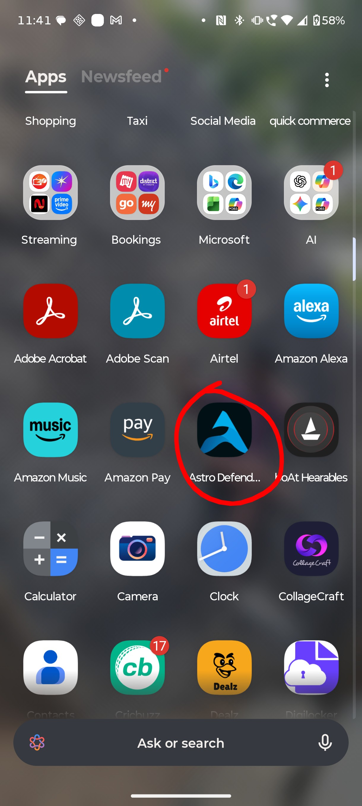
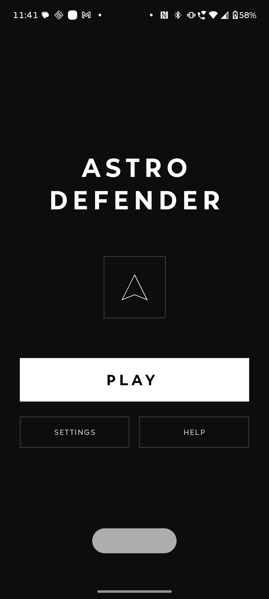
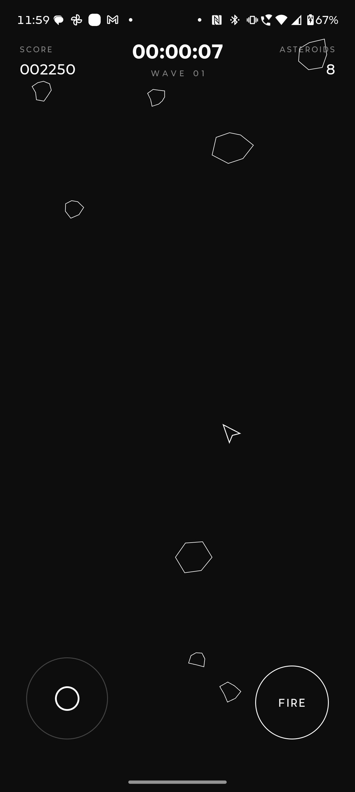
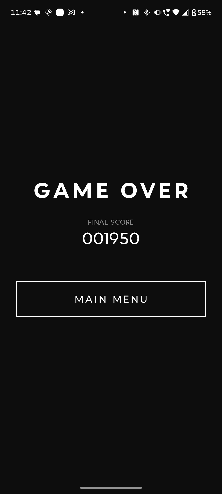

# Astro Defender 🚀

**Astro Defender** is a fast-paced, 2D arcade space shooter built entirely for Android using **Jetpack Compose** and **Kotlin**. Defend your spaceship against endless waves of asteroids, rack up your high score, and survive the cosmos for as long as you can!

---

## 📸 Screenshots

Here is a look at the game in action:

### App Logo


### Main Menu


### Action Gameplay


### Game Over & Score


---

## ✨ Features

*   **Custom Jetpack Compose Engine:** Rendering, movement, and collision detection are built entirely from scratch using the Compose `Canvas` API.
*   **Virtual Joystick Controls:** Smooth, touch-based 360-degree movement paired with a dedicated firing mechanic.
*   **Dynamic Theme API:** The game connects to a remote server on the loading screen to fetch dynamic laser colors, background images, and audio tracks using Retrofit.
*   **Wave Progression:** The game gets progressively harder. Large asteroids split into smaller, faster projectiles when destroyed, and wave sizes increase as you survive.
*   **Offline Fallback:** If the theme API is unreachable, the game gracefully falls back to default local assets so the action never stops.

---

## 🛠️ Tech Stack

*   **Language:** Kotlin
*   **UI Framework:** Jetpack Compose
*   **Networking:** Retrofit2 & OkHttp3 (for dynamic asset downloads)
*   **Concurrency:** Kotlin Coroutines
*   **Media:** Android `MediaPlayer`

---

## 🚀 How to Run Locally

1. Clone the repository to your local machine:
```bash
   git clone [https://github.com/yourusername/Astro-Defender.git](https://github.com/yourusername/Astro-Defender.git)
